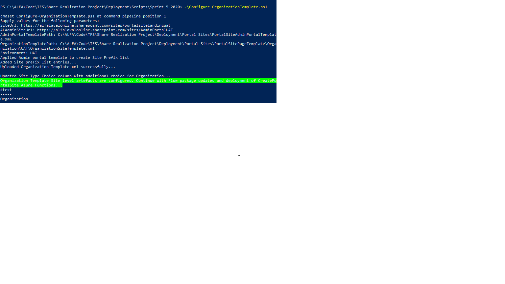

# Add / Update Portal site creation with addtional template for Organization
# User story related
Feature 6406
U.S 6551
U.S 6454
U.S 6455
U.S 6435
U.S 6436

# Minor/Major Adjustment to current solution

1. Updated code to read Site Prefix from Admin portal instead of Hardcoding in Azure function
2. Added Organization template in Portal site creation

# Configuration steps

1.  Open Windows powershell
2.  Navigate to "Sprint 5 - 2020" folder under "Deployment/Scripts/Sprint 5-2020"
3.  Run ./Configure-OrganizationTemplate.ps1 -siteUrl {Portal Site Landing Url} -adminSiteUrl "{Admin portal Url}" -AdminPortalTemplatePath "{PortalSoteAdminPortalTemplate.xml path}" -OrganizationTemplatePath {OrganizationSiteTemplate.xml path} -Environment {Dev/UAT/PROD}
4.  Successful run looks like below

5.  Deploy "CreatePortalSite" Azure function to respective Function App
6.  Update Configuration of respective Function App
    1.  Add below additional key value entry
    2.  AdminPortal | {Respective environment Admin portal Url}

